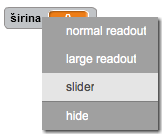
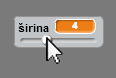
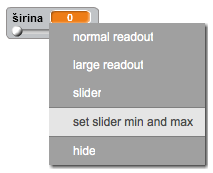

## Promjena debljine olovke

Omogućimo korisniku da crta koristeći olovke različitih debljina.

+ Prvo dodaj novu promjenljivu (variable) pod nazivom `širina`{:class="blockvariable"}.

[[[generic-scratch-add-variable]]]

+ Dodaj ovaj red *unutar* petlje `forever`{:class="blockcontrol"} (ponavljaj) u kôdu olovke:

```blocks
    set pen size to (širina)
```

Debljina olovke sada će biti stalno postavljena na vrijednost promjenljive 'širina'.

+ Klikni desnim tasterom miša na prikaz promjenljive na pozornici i klikni na 'slider' (klizač).



Sada možeš da povlačiš klizač ispod promjenljive da promijeniš njenu vrijednost.



+ Isprobaj svoj projekat i provjeri da li možeš da promijeniš debljinu olovke.


Ako želiš, možeš da postaviš najmanju i najveću dozvoljenu vrijednost 'širine'. To ćeš uraditi tako što ćeš ponovo kliknuti desnim tasterom miša na promjenljivu i kliknuti na 'set slider min and max' (postavi klizač na min i max). Postavi najmanju i najveću vrijednost promjenljive koje imaju smisla, na primjer 1 i 20.



Nastavi da isprobavaš promjenljivu 'širina' sve dok ne budeš zadovoljan/zadovoljna.