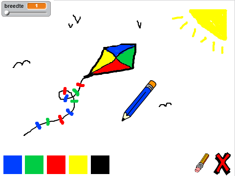

--- no-print ---

This is the **Scratch 2** version of the project. There is also a [Scratch 3 version of the project](https://projects.raspberrypi.org/nl-NL/projects/paint-box).

--- /no-print ---

## Inleiding

Maak je eigen teken programma!

### Wat ga je maken

Klik op de groene vlag om te starten. Gebruik de muis om het potlood te verplaatsen en houd de linkermuisknop ingedrukt om te tekenen. Klik op een kleur om van potlood te wisselen of klik op het gum om je werk uit te gummen. Klik op het kruisje om alles te wissen.

  <iframe allowtransparency="true" width="485" height="402" src="//scratch.mit.edu/projects/embed/219860302/?autostart=false" frameborder="0"></iframe>
  

### Wat ga je leren

Dit project behandelt elementen uit de volgende onderdelen van de[Raspberry Pi Digital Making Curriculum](http://rpf.io/curriculum){:target="_blank"}:

+ [Combineer programma lussen om een probleem op te lossen.](https://www.raspberrypi.org/curriculum/programming/builder){:target="_blank"}

### Aanvullende informatie voor clubleiders

Als je dit project wilt afdrukken, gebruik dan de [printvriendelijke versie](https://projects.raspberrypi.org/nl-NL/projects/paint-box-scratch2/print){:target="_ blank"}.

Gebruik de link in de voettekst om toegang te krijgen tot de GitHub-repo voor dit project, deze bevat alle bestanden (inclusief een voltooid projectvoorbeeld) in de map 'nl-NL/resources'.