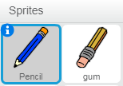
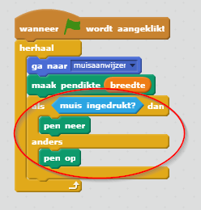
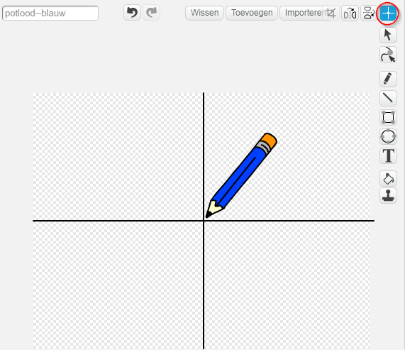

## Een potlood maken

Laten we beginnen met het maken van een potlood dat kan worden gebruikt om op het speelveld te tekenen.

+ Open het 'Paintbox' Scratch-project online op [jumpto.cc/paint-go-nl-NL](https://scratch.mit.edu/projects/227795336/#editor){:target="_blank"} of download van [http://jumpto.cc/paint-get-nl-NL](https://github.com/raspberrypilearning/paint-box-scratch2/raw/master/nl-NL/resources/PaintBox.sb2){:target="_blank"} en open het als je de offline-editor gebruikt.

Je zult potlood- en gumsprites zien:



+ Voeg wat code toe aan de potloodsprite om ervoor te zorgen dat deze de muis altijd volgt met een `herhaal blok`{:class="blockcontrol"}, zodat je kunt tekenen:

```blocks
    wanneer groene vlag wordt aangeklikt
    herhaal 
    ga naar [muisaanwijzer v]
    einde
```

+ Klik op de vlag en beweeg de muis over het werkgebied om te testen of de code werkt.

Laat vervolgens je potlood alleen tekenen `als`{:class="blockcontrol"} er op de muis wordt geklikt.

+ Voeg deze code toe aan je potlood sprite:



+ Test je code opnieuw. Verplaats deze keer het potlood in het speelveld en houd de muisknop ingedrukt. Kun je met je potlood tekenen?


--- collapse ---
---
title: Als je problemen hebt...
---
Als je potlood de lijn lijkt te trekken vanuit het midden van het potlood in plaats vanuit de punt, moet je het centrum van je uiterlijk wijzigen.



Het draadkruis voor het potlood moet **net onder** de punt van het potlood worden geplaatst, niet op het puntje van het potlood.

Een wijziging in het 'uiterlijk-centrum' van een sprite wordt niet uitgevoerd totdat op een ander tabblad wordt geklikt, dus klik op een ander uiterlijk of op het tabblad 'Scripts' om de wijzigingen in het uiterlijk-centrum te voltooien.

--- /collapse ---
