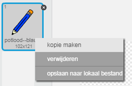
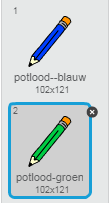
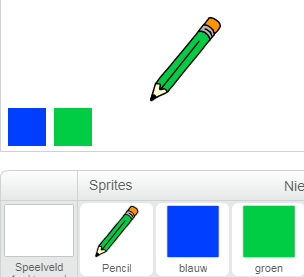
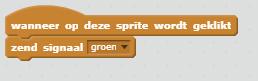
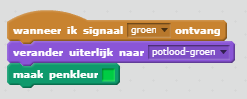
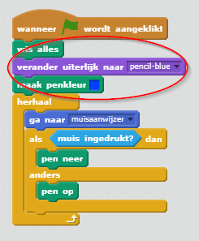

## Kleurpotloden

Laten we verschillende kleurpotloden aan je project toevoegen en de gebruiker de mogelijkheid geven om een kleur te kiezen.

+ Klik op je potloodsprite, klik op 'Uiterlijken' en maak een kopie van je 'pencil-blue' uiterlijk.



+ Hernoem je nieuwe kostuum 'potlood-groen' en kleur het potlood groen.



[[[generic-scratch-rename-sprite]]]

+ Teken twee nieuwe sprites - een blauw vierkant en een groen vierkant. Je gaat deze gebruiken om het blauwe of groene potlood te selecteren.



+ Hernoem je sprites zodat ze 'blauw' en 'groen' heten

+ Voeg wat code toe aan de 'groene' sprite, zodat wanneer er op geklikt wordt, het `zend signaal`{:class="blockevents"} het bericht "groen" naar de potloodsprite zal gaan, zeggend dat het zijn uiterlijk en de potloodkleur moet veranderen.



[[[generic-scratch-broadcast-message]]]

+ Schakel over op je potloodsprite. Voeg wat code toe zodat wanneer deze sprite het `zend signaal`{:class="blockevents"} groen ontvangt, deze moet overschakelen naar het groene potlooduiterlijk en de potloodkleur moet veranderen in groen.



Als je het potlood op groen wilt zetten, klik je op het gekleurde vak van het groene blok `penkleur instellen`{:class="blockpen"} en klik je op de groene sprite om dezelfde kleur groen te kiezen als je potlood kleur.

+ Je kunt nu hetzelfde doen voor het blauwe potloodpictogram: voeg deze code toe aan de blauwe vierkante sprite:

```blocks
wanneer op deze sprite wordt geklikt
zend signaal [blauw v]
```

... en voeg deze code toe aan de potloodsprite:

```blocks
wanneer ik signaal [blauw v] ontvang
verander uiterlijk naar [potlood-blauw v]
maak penkleur [#0000ff]
```

+ Voeg ten slotte deze code toe om de sprite van het potlood te vertellen om met welke kleur te beginnen en zorg ervoor dat het scherm schoon is.



We hebben ervoor gekozen om met blauw te beginnen, maar als je wilt, kunt je met een ander kleurpotlood beginnen.

+ Test je project. Kun je schakelen tussen blauwe en groene potloden door op de blauwe of groene vierkante sprites te klikken?

