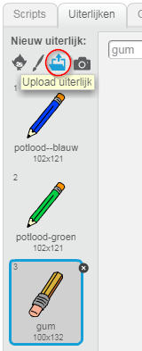
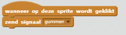
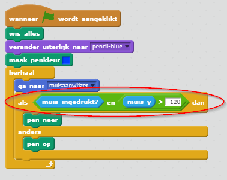

## Fouten maken

Soms maak je fouten, dus laten we een knop 'wissen' en een gum toevoegen.

+ Voeg de sprite 'X-block' toe - je vindt het in de bibliotheek, in het gedeelte met letters. Kleur het uiterlijk rood. Dit wordt de knop 'alles wissen'.


+ Voeg code aan deze sprite toe om het speelveld te wissen als erop geklikt wordt.


Merk op dat je geen bericht hoeft te sturen om het speelveld te wissen, je kunt gewoon het wis alles-blok voor deze sprite gebruiken.

Je hebt waarschijnlijk gemerkt dat je potloodsprite een gum aan het uiteinde bevat:



+ Je project bevat ook een afzonderlijke gumsprite. Klik met de rechtermuisknop op deze sprite en kies 'verschijn'. Hier is hoe je speelveld eruit zou moeten zien:


+ Voeg code toe aan de gumsprite om het potlood te laten overschakelen naar een gum wanneer op de sprite wordt geklikt.



Wanneer het potlood de "gum"-boodschap ontvangt, kunt je het potloodkostuum in de gum veranderen en de potloodkleur in wit veranderen - dezelfde kleur als het podium!

+ Voeg een code toe om de gum te maken

--- hints --- --- hint --- Voeg deze code toe aan de potloodsprite: **wanneer ik signaal** **gum ontvang** **verander uiterlijk naar** gum **maak penkleur** wit --- /hint --- --- hint --- Zo zou je code in de potloodsprite eruit moet zien:

```blocks
wanneer ik signaal [gum] ontvang
verander uiterlijk naar [gum]
maak penkleur [#FFFFFF]
```

--- /hint --- --- /hints ---

+ Test je project, om te zien of je kunt wissen en het hele speelveld kan wissen.


Er is nog een probleem met het potlood - je kunt overal op het podium tekenen, ook in de buurt van de kleur selectie-pictogrammen!


Om dit te verhelpen, vertel het potlood alleen om te tekenen als op de muis wordt geklikt *en* als de y-positie van de muis groter is dan -120:



+ Test je project; je zou nu niet in staat moeten zijn om in de buurt van de kleur selectie-blokken te tekenen.


