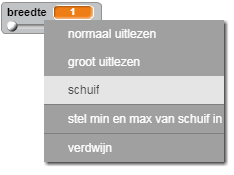
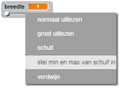

## De potlooddikte wijzigen

Laten we het mogelijk maken dat de gebruiker kan kiezen uit een reeks verschillende potlooddiktes.

+ Voeg eerst een nieuwe variabele toe met de naam `breedte`{:class="blockvariable"}.

[[[generic-scratch-add-variable]]]

+ Voeg deze regel *toe* aan het `herhaal`{:class="blockcontrol"} blok van de potloodcode:

```blocks
    maak pendikte (breedte)
```

De potloodbreedte wordt nu steeds ingesteld op de waarde van de variabele 'breedte'.

+ Klik in het speelveld met de rechtermuisknop op de weergave van de breedte en klik op 'schuif'.



Je kunt nu de schuifregelaar onder de variabele verslepen om de waarde te wijzigen.


+ Test je project en kijk of je de potloodbreedte kunt wijzigen.


Als je wilt, kunt je de minimum- en maximumwaarde van 'breedte' instellen. Klik hiertoe met de rechtermuisknop op de variabele en klik op 'stel min en max van schuif in'. Stel de minimum- en maximumwaarden van je variabele in op iets dat beter is, zoals 1 en 20.



Blijf je variabele 'breedte' testen totdat je tevreden bent.