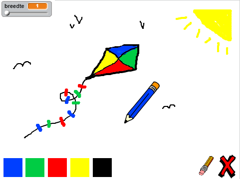

--- challenge ---

## Uitdaging: meer potloden

Kun je rode, gele en zwarte potloden toevoegen aan je tekenprogramma? Bekijk stap 2 hierboven als je bent vergeten hoe je dit moet doen. Vergeet niet om sneltoetsen voor deze nieuwe potloden toe te voegen.

Kun jij je potloden gebruiken om een foto na te tekenen?

--- /challenge ---
***
### Door de community geleverde vertaling 

Dit project werd vertaald door **Cor Groot** en **Jeroen Dekker**.

Onze geweldige vertalers helpen ons om kinderen over de hele wereld de kans te geven te leren coderen. Jij kunt ons helpen nog meer kinderen te bereiken door onze projecten te vertalen - lees meer op [rpf.io/translators](https://rpf.io/translators).
